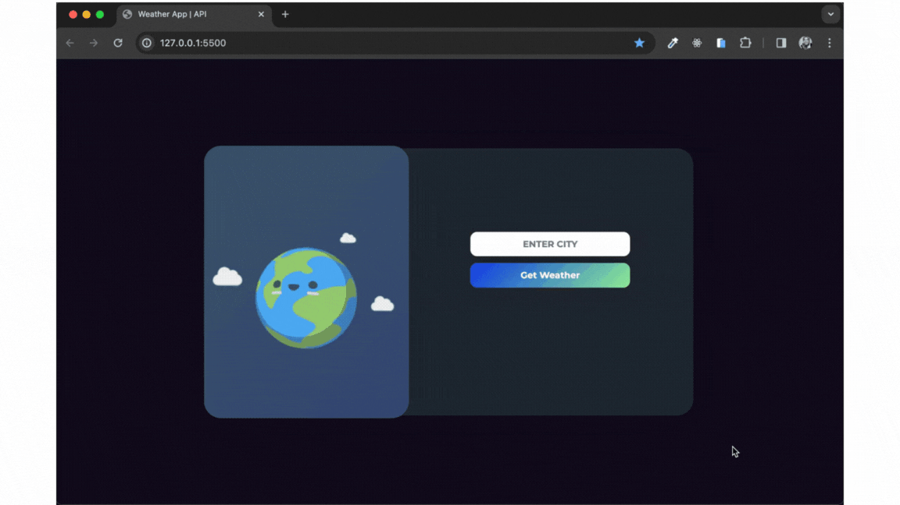

# Weather Application

This project is a web application that displays weather forecasts. Users can enter a city name and view current weather information as well as five-day weather forecasts.

## Technologies Used

This project has been developed using the following technologies:

- **HTML:** Used to structure the page.
- **CSS:** Used for page styling and design.
- **JavaScript:** Used for page interactions and fetching data from the API.
- **OpenWeatherMap API:** Used to fetch weather data.
- **Feather Icons:** Used for displaying icons.

## JavaScript Methods

Some important JavaScript methods used in the project are as follows:

- **`document.querySelector()`:** Used to select various DOM elements in HTML.
- **`fetch()`:** Used to fetch data from the API. An example of usage with "async await" structure is also provided in the JavaScript file as a comment.
- **`addEventListener()`:** Used to assign a function to be executed when a specific event occurs.
- **`feather.replace()`:** Used to reload the Feather icon set on the page.

## Used Icons

The icons used in the weather forecasts are as follows:

- **Sunny:** `sun`
- **Cloudy:** `cloud`
- **Rainy:** `cloud-rain`
- **Snowy:** `cloud-snow`
- **Stormy:** `wind`
- **Foggy:** `cloud-drizzle`

## Icon Library

The Feather icon library is used for icons in the project. For more information, visit the [Feather Icons](https://feathericons.com/) website.

## Installation

1. Download or clone the project files to your computer.
2. Navigate to the downloaded directory and open the `index.html` file in a web browser.

## Usage

- Enter a city name in the text input at the top of the page.
- Click the "Get Weather" button.
- Current weather information and five-day forecasts will appear on the right side.

## Dynamic Backgrounds

The background of the page changes according to weather conditions. The following backgrounds are used based on weather conditions:

- **Sunny:** `clear.png`
- **Cloudy:** `clouds.png`
- **Rainy:** `rain.png`
- **Snowy:** `snow.png`
- **Stormy:** `thunderstorm.png`
- **Foggy:** `drizzle.png`

## Screenshots

## Contributions

This project has been developed for educational purposes. Contributions are welcome! If you would like to contribute to this project, you can fork this repository and send a pull request.

## License

This project is licensed under the MIT License. It is prepared for educational purposes, not for commercial purposes. For more information, see the `LICENSE` file.
